# Commander Firefly POC

Commander Password Rotator Proof Of Concept (POC)
This template will create fully working Password rotation POC in Azure Cloud that will have endpoints to rotate Active Directory Users Password based on Keeper Record UID.

Following Components will be created and configured:

- App Service (Web App hosting Python Rest endpoints)
  - Source code will be cloned from GitHub project
  - Environment variables will be configured based on the data entered in the initial form

## Prerequisites

- Azure account with Active Subscription. [Link](https://portal.azure.com/#blade/Microsoft_Azure_Billing/SubscriptionsBlade) to add new Subscription to the existing Azure account
- New or existing Resource Group
- Keeper Account
- Records in Keeper Vault
  1. Azure Service User with appropriate permissions with custom fields
  2. Azure Active Directory users details whose password will be rotated
- Locally installed [Keeper Commander](https://github.com/Keeper-Security/Commander)

## Components Diagram

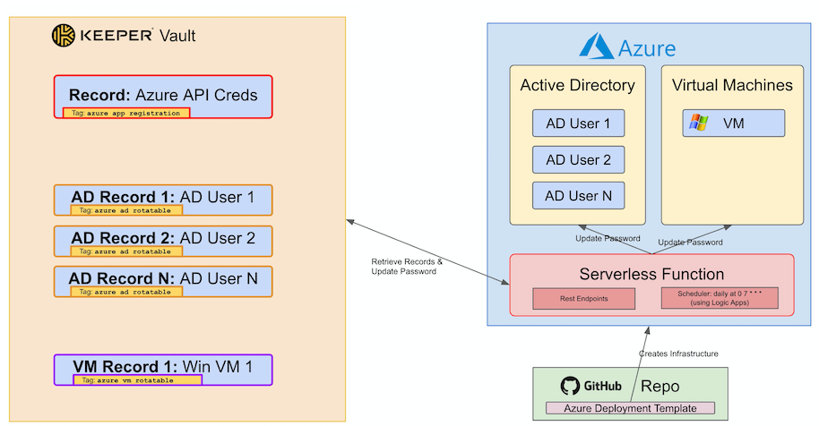

## Setup Steps

### 1. Configure Keeper Account

1. Login to [Keeper Vault](https://keepersecurity.com/vault/) with the new or existing Keeper Account
2. Make sure that 2FA is disabled by going to `Settings` -> `Security` and uncheck "Two-Factor Authentication"

### 2. Generate Keeper Commander Configuration file

1. Using [Keeper Commander](https://github.com/Keeper-Security/Commander) on local machine login using command: `keeper login`   
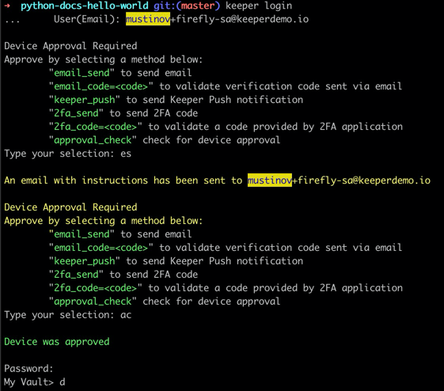   This will generate a new `config.json` file in the current working directory  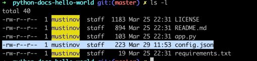 
   Open that file and take note of all the generated values there. We will use them later when we will be deploying Template to Azure

### 3. Create Azure API Access (App Registration)

Needed for the Function to interact with Azure Active Directory API

1. Create App Registration and Secret.

   Follow steps from [HERE](https://github.com/Keeper-Security/Commander/tree/master/keepercommander/plugins/azureadpwd#configure-azure-application)

2. Create new Keeper Record with custom fields containing App Registration details

   Custom fields:

   | Custom field name | Custom field value |
      | ----------------- | ------------------ |
   | `cmdr:azure_tenant_id` | Tenant ID |
   | `cmdr:azure_client_id` | Client ID |
   | `cmdr:azure_secret` | Client Secret |
   | `tag` | `azure app registration` |

   Refer to [THIS](https://github.com/Keeper-Security/Commander-Firefly/blob/main/docs/img_1.png) image

Sample record in Keeper Vault 
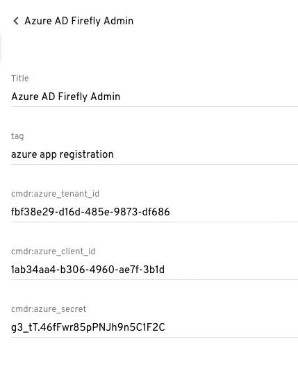

### 4a. Create Azure AD Accounts/Users and Keeper Record
- Follow steps from [the official Azure Documentation](https://docs.microsoft.com/en-us/azure/active-directory/fundamentals/add-users-azure-active-directory)
- Make a record for each account in Keeper Vault. Enter email address of the Azure AD User in the "Login" field and add following custom fields to mark it as rotatable:

| Custom field name | Custom field value |
| ----------------- | ------------------ |
| `tag` | `azure ad rotatable` |

 Sample record in Keeper Vault
 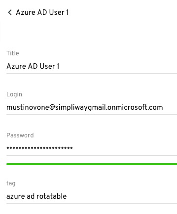

### 4b. Create Azure Windows VM and Keeper Record

- [Create new](https://portal.azure.com/#create/Microsoft.VirtualMachine) Standard Windows VM
    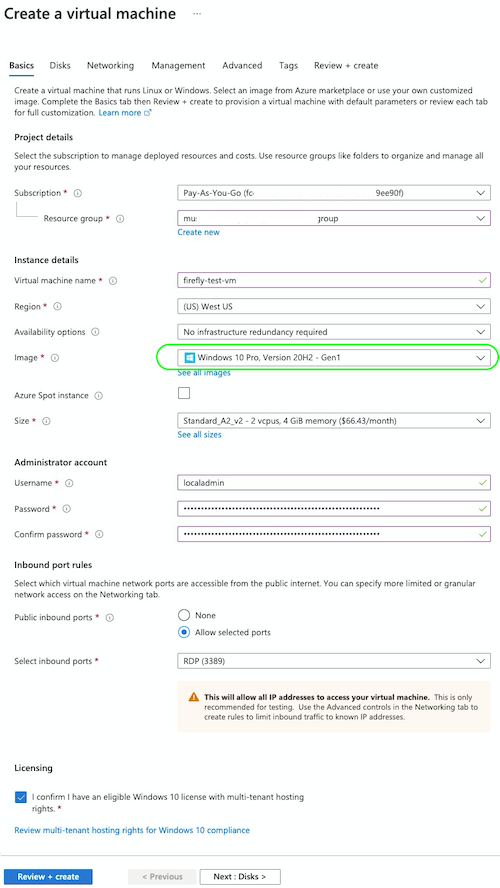

- Enable permissions (RBAC) for App Registration:

  - Go to VM -> `Access control (IAM)` -> Under `Grant access to this resource` press `Add role assignments`

    Role: `Owner`
    Assign access to: `User, group, or service principal`
    Select: [Type App Service name]

    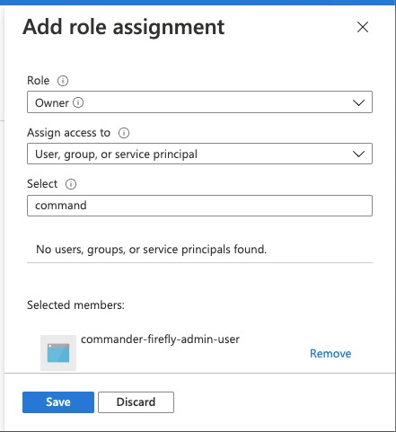

- Create new record for this VM:

    | Regular or Custom field name | Custom field value |
    | ----------------- | ------------------ |
    | `Login` | User name to be used for local admin. Same value as in `Username` field in the new VM form |
    | `az:subscription_id` | Azure Subscription ID |
    | `az:vm_name` | Name of the virtual machine |
    | `tag` | `azure vm rotate` |

    Example Keeper Record:
  
    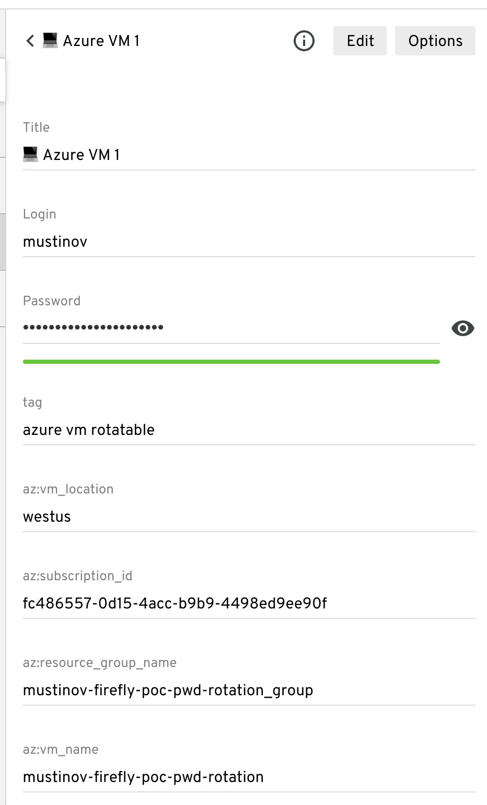

### 5. Deploy a template to Azure

 

Fill out fields:

- Resource Group: Select Resource Group where infrastructure will be created
- Keeper Config Private Key: Value `private_key` from config.json file
- Keeper Config Device Token: Value `device_token` from config.json file
- Keeper User Email: Keeper Account User Email
- Keeper User Password: Keeper Account Password

The following infrastructure will be created     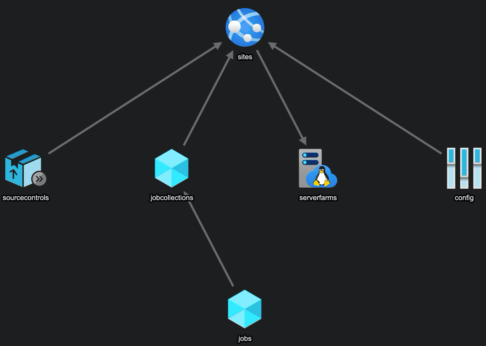

### 6. Test

After infrastructure is creates, after about 5 - 10 min, navigate to the URL of the created website. URL can be found in the Overview page     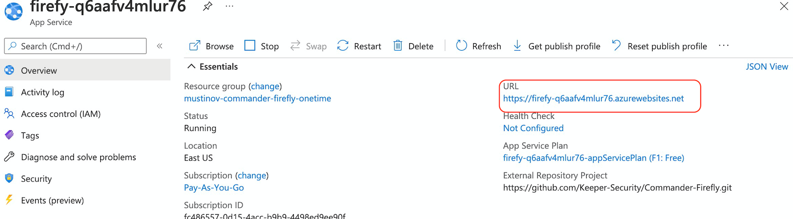

1. Rotate All Records

   [app-url]/api/v1/firefly/rotate

2. Rotate a single Record

   [app-url]/api/v1/firefly/rotate?uid=UID123

### 7. Update Code

Once there is a new code published to Git repository, the code in App Service can be updated by going to: "Deployment Center" -> Click on "Sync"

### 8. Cleanup

Login to Azure Portal, navigate to the Resource Group where the code was deployed and remove following:

- App Service: `firefly-[GUID]`
- App Service plan: `firefly-[GUID]-appServicePlan`
- Scheduler Job Collection: `firefly-[GUID]-cron`    
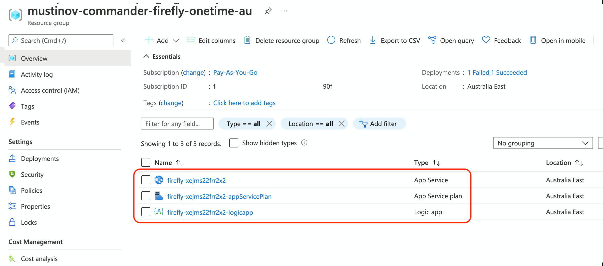
