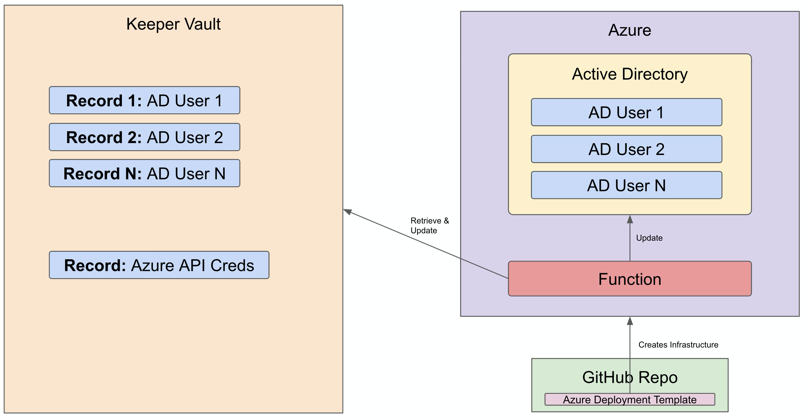
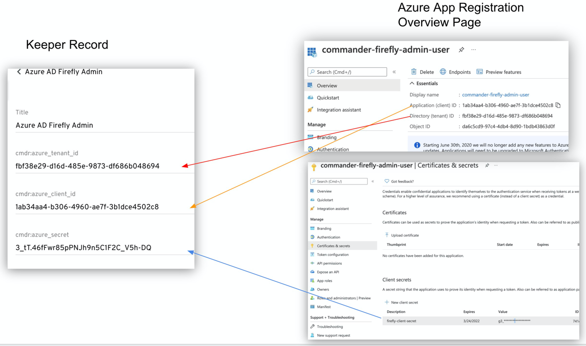

# Commander-Firefly

Commander Password Rotator Proof Of Concept (POC)
This template will create fully working Password rotation POC in Azure Cloud that will have endpoints to rotate Active Directory Users Password based on Keeper Record UID.

Following Components will be created and configured:

- App Service (Web App hosting Python Rest endpoints)
  - Source code will be cloned from GitHub project
  - Environment variables will be configured based on the data entered in the initial form

## Prerequisites

- Azure account with Active Subscription. [Link](https://portal.azure.com/#blade/Microsoft_Azure_Billing/SubscriptionsBlade) to add new Subscription to the existing Azure account
- New or existing Resource Group
- Keeper Account
- Records in Keeper Vault
  1. Azure Service User with appropriate permissions with custom fields
  2. Azure Active Directory users details whose password will be rotated
- Locally installed [Keeper Commander](https://github.com/Keeper-Security/Commander)

---------------
WORK IN PROGRESS

---------------

This application works both with Azure Active Directory and Keeper to keep password

Setup:
1. Collect Config details
    
    a. Using [Keeper Commander](https://github.com/Keeper-Security/Commander) generate config file
    
    b. 

2. In Keeper Vault create a new record that will contain details for the Azure Active Directory App registration. See below how to obtain one.
Custom fields in the record:
   
| Custom field name | Custom field value |
| ----------------- | ------------------ |
| `cmdr:azure_tenant_id` | Tenant ID |
| `cmdr:azure_client_id` | Client ID |
| `cmdr:azure_secret` | Client Secret |

Rest endpoints:
Rotate all records: [app-url]/api/v1/firefly/rotate

Rotate single record: [app-url]/api/v1/firefly/rotate?uid=UID123

Tell what to do after deployment
   Screenshot of the Azure App S

How to pause

How to delete

## Azure AD App Registration
Steps to obtain Azure Active Directory App registration with permissions to modify password in Active Directory

### Register new application
1. Navigate to new app registration page: Azure portal -> `Azure Active Directory` -> `App Registrations` -> `New Registration`
2. Give a name to the application and leave Supported account type as "Accounts in this organizational directory only (Default Directory only - Single tenant)"
3. Click "Register"

### Add a role to the application
1. Azure portal -> `Azure Active Directory` -> `Roles and administrators`
2. Search for `Helpdesk Administrator` role and click on it
3. Click on `+ Add assignments`
4. Search for the application that was created above, select it, and click on "Add"

### Create App Secret
1. Navigate to Azure portal -> `Azure Active Directory` -> `App Registrations` -> Select app that was created above -> `Certificates & secrets`
2. Under "Client secrets" click on `+ New client secret`
3. Give description to a secret and click "Add"
4. Make sure to copy "Value" of the secret